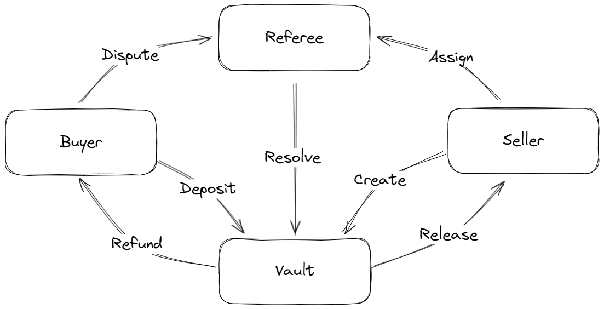

# Seahorse Escrow

Almost all DeFi protocols need to take custody of users fund. Our Escrow program demonstrates how to achieve that safely with **Seahorse**.

Please refer to the [Counter program](https://github.com/kenchan0824/sea-counter) for the Seahorse basics. Also, [Simple-Web3](https://github.com/kenchan0824/simple-web3) is used in the test module, you may read the docs there.

## Use Cases
This project is motivated by an imaginary E-commerce scenario, where the sellers list their products or services with the dedicated price. 



- If a buyer takes the deal, the seller would issue him an escrow order with an assigned referee. 
- The buyer then commits the deal by depositing funds to the order vault. 
- When the product is fulfilled, he can instruct the order vault to release the funds to the seller. 
- Otherwise, he can dispute to the referee and ask for a refund. 


## Pre-requisites
- Solana 1.18.12
- Anchor 0.29.0
- Seahorse 0.2.0

## Steps to run
[1] Clone the repository to your local machines.
```
git clone https://github.com/kenchan0824/sea-escrow
```

[2] Go to the project folder and install all packages.
```
npm i
```

[3] Pre-build Anchor
```
anchor build
```

[4] Run tests
```
npm test
```

[5] You may do some experiments with the codes inside `programs_py/sea_escrow.py` and `tests/sea_escrow.ts`

## To-Do

- [] sellers can dispute to referee
- [] referee can release funds to sellers
- [] referee can only refund or resolve when dispute
- [] only assigned referee can refund or resolve
- [] refund must be made only to the buyer
- [] resolve only release funds to the seller
- [] referee can take commission from the trade